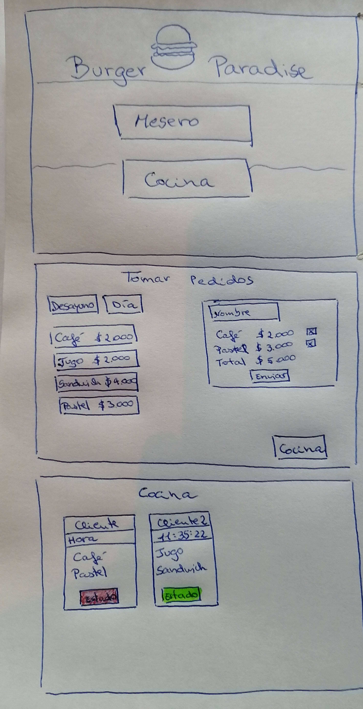
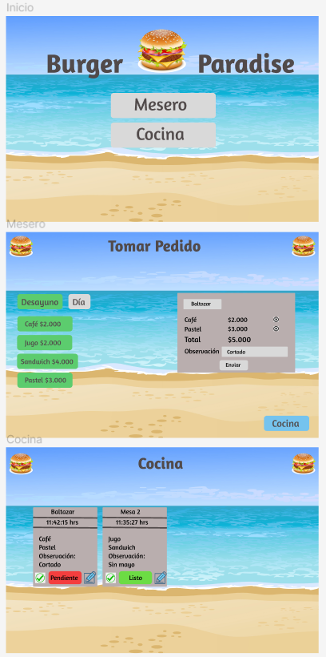
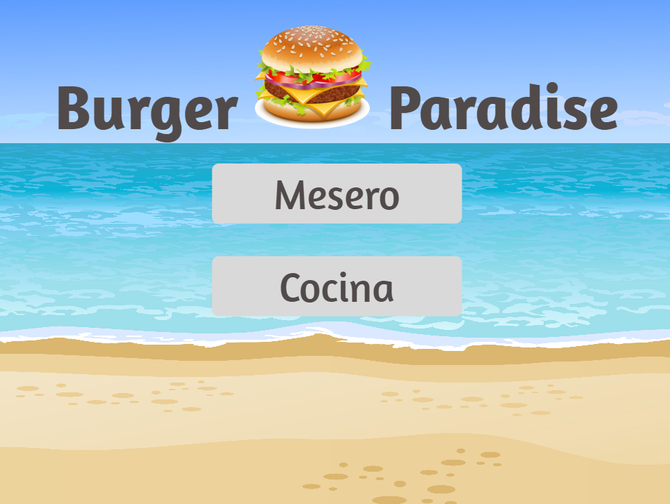
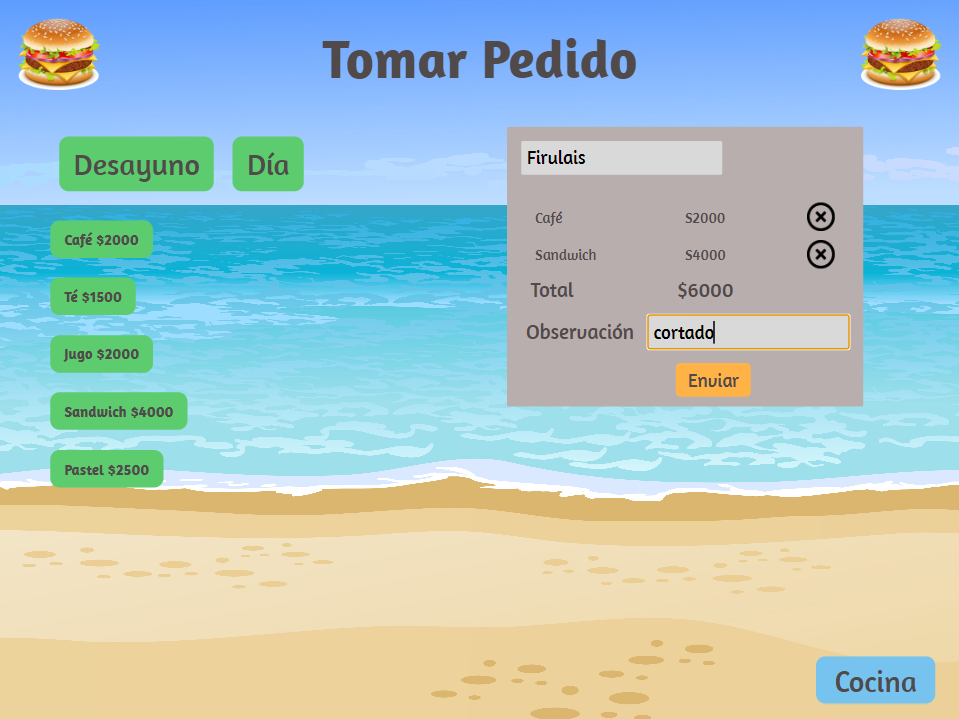
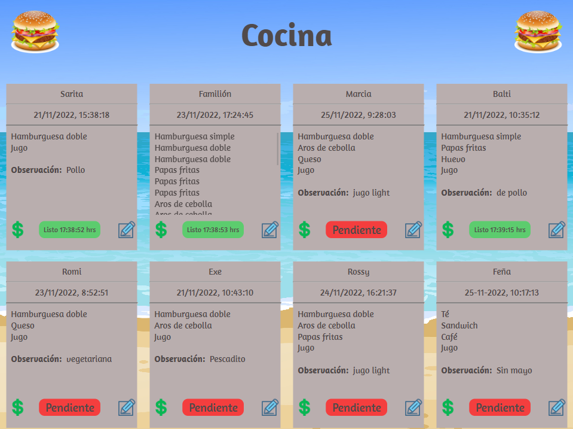

# Burger Paradise

## Índice

* [1. Resumen del proyecto](#1-resumen-del-proyecto)
* [2. Historias de usuario](#2-historias-de-usuario)
* [3. Prototipo de baja](#3-prototipo-de-baja)
* [4. Prototipo de alta](#4-prototipo-de-alta)
* [5. Resultado final](#5-resultado-final)

## 1. Resumen del proyecto

Burger Paradise es una App para tablets que permite tomar pedidos y enviarlos a la cocina.

Para utilizarla, ingresa por [acá](https://burger-paradise.web.app/login).

Este proyecto es una Web App responsive y utilicé React y Firebase. Además la aplicación es una SPA.

## 2. Historias de usuario

1. Yo como meserx quiero tomar el pedido de un cliente para no depender de mi mala memoria, para saber cuánto cobrar, y enviarlo a la cocina para evitar errores y que se puedan ir preparando en orden.
2. Yo como jefx de cocina quiero ver los pedidos de los clientes en orden y marcar cuáles están listos para saber qué se debe cocinar y avisar a lxs meserxs que un pedido está listo para servirlo a un cliente.
3. Yo como meserx quiero ver los pedidos que están preparados para entregarlos rápidamente a los clientes que las hicieron.

## 3. Prototipo de baja

## 4. Prototipo de alta

## 5. Resultado final

